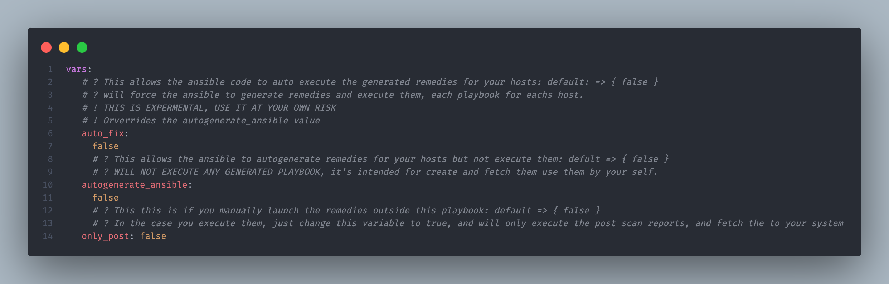
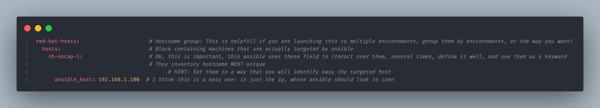

<div style="text-align: center">
<h3 align="center" dir="auto" class="heading-element" >  </br></br>
  The Ansible project that will help you to evaluate and get vulnerabilities fixed like is magic
</h3>
  <hr>
</div>
<div align="center">


[](https://github.com/pvcasillasg/OpenScap_Ansible/actions/workflows/ansible-lint.yml)

</div>
</br></br></br></br>

## Getting Started

The use is easy, just download this project to your machine, modify the inventory with your targets machines ( Keep in mind is important to use the same pattern as it's in the example ), modify if you want the variables, and drop your generated tailored rule set to the tailored folder, and you are ready to go

All the variables are setted in the file: Group_vars/all.yml - Every single one is commented, so the user can know exatly what it configures

Some of the roles are experimental, like the autofix, is not heavily tested and can make some issues in your target systems, Use it at your own risk

This Ansible will use several roles for every action it takes, you can find them all in roles folder
</br>
</br>

## How to use?

:one:- You will need to get the repo in order to launch or run it.

```bash
  git clone https://github.com/pvcasillasg/OpenScap_Ansible.git
```

There you go, but, now what?
</br>
</br>
:two:- Well in this point you will need to provide a custom tailored rule set from [Scap Workbench](https://www.open-scap.org/tools/scap-workbench/) ( good luck with that, i''m personally think is a little tricky )

> [!TIP]
> Use the same pattern as the default xml: ssg-rhel9-ds.xml => ssg-rhel9-ds-tailored.xml

</br>
</br>

:three:- OK, i have my tailor roule set and it matches the pattern you told me, so now?
EASY! let's modify this to make it work how you want

The easiest way is to open your favorite text editor, and go directly to the main.yml folder.


Quick explanation of the control_vars:

:arrow_down::heavy_exclamation_mark: Uses de openscap generate remedies module, to create a ansible playbook which help you to solve several issues :heavy_exclamation_mark::arrow_down:

```yaml
autogenerate_ansible: false / true
```

:arrow_down::heavy_exclamation_mark: Will execute a scan report, and fetch the pre and pro reports to your machine and skip the rest of code :heavy_exclamation_mark::arrow_down:

```yaml
only_post: false / true
```

> [!CAUTION]
> :warning: :construction: :heavy_exclamation_mark: THIS IS EXPERIMENTAL, will run the generated remedies by it's own, can cause issues in your target hosts :heavy_exclamation_mark: :warning: :construction:

```yaml
auto_fix: false / true
```

You setted up your control variables? Are you sure? worth expend a moment to double check, i'll wait.

Checked? all good? Ok, fine.

Now you will modify your inventorie, so you can use this where you want, i will explain as much as i can if you are new to ansible, don't worry



You can change the inventory as you want

> [!WARNING]
> :warning: :heavy_exclamation_mark: be sure to always set a inventory hostname for each host. :heavy_exclamation_mark: :warning:

:five: - Well, that's all, easy to configure in order to make it running!
So let's execute it

```bash
  ansible-playbook -i inventories/$env/$hosts.yml
```

Yeah, that's it, you dont need any extra variables, or anything else.

> [!TIP]
> If you want to execute this only in a specific host, instead of remove the rest of them from the inventory, you can use:

```bash
  ansible-playbook -i inventories/$env/$hosts.yml -l $target_host
```

</br></br>

## Contributing

Pull requests are welcome. For major changes, please open an issue first
to discuss what you would like to change.

Please make sure to update tests as appropriate.

Feel free to contact me if you need help!
</br></br>

## License

[GPLv3](https://choosealicense.com/licenses/gpl-3.0/)

</br></br>

## Links

[](https://www.linkedin.com/in/pablovcasillas/)
